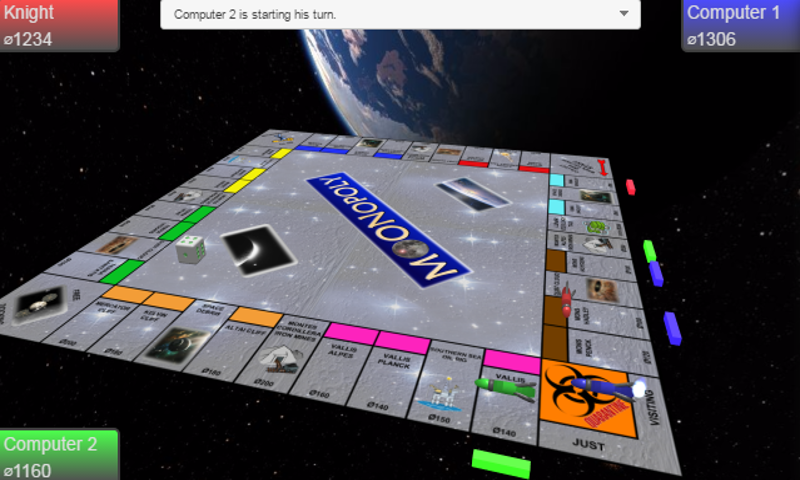
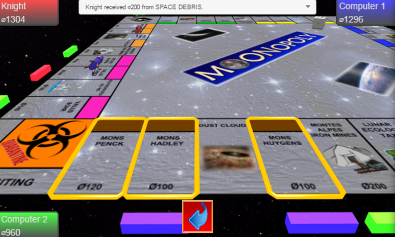
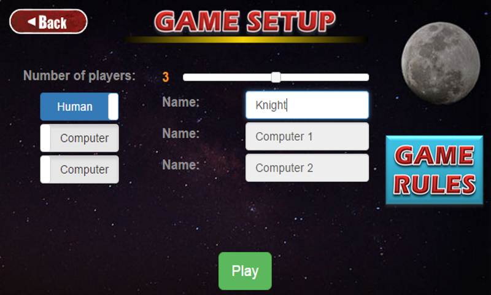
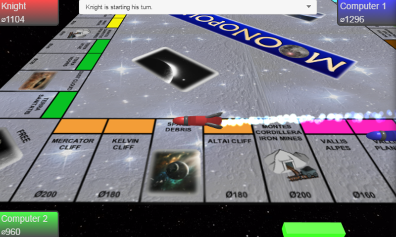

# Moonopoly
Insipired by a popular board game, this is a turn-based strategy game with a space exploration theme. Implemented using TACO (Tools for Apache Cordova), using Angular.js, Typescript and babylon.js for 3D rendering.
It is dating back to 2017 and would require some updating to make it work with the latest version of the toolset.

It is configured to be built with Windows Phone set as the target. It hasn't yet been configured and tested with Android or iPhone. 

